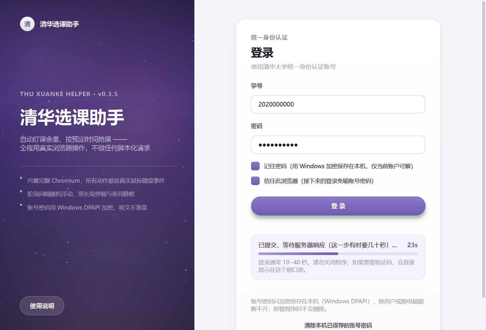
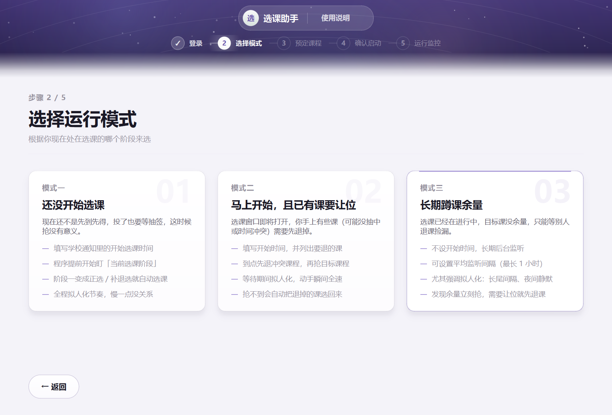
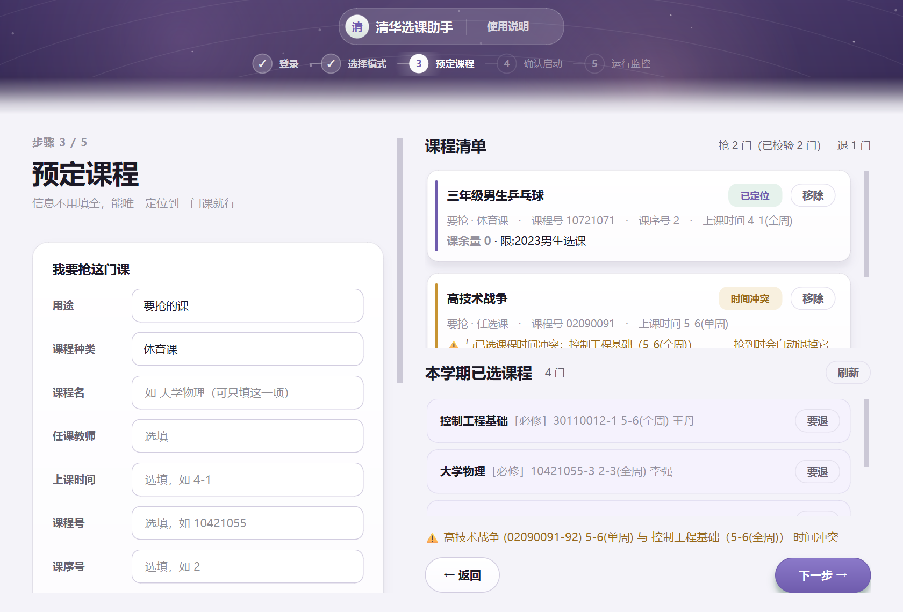
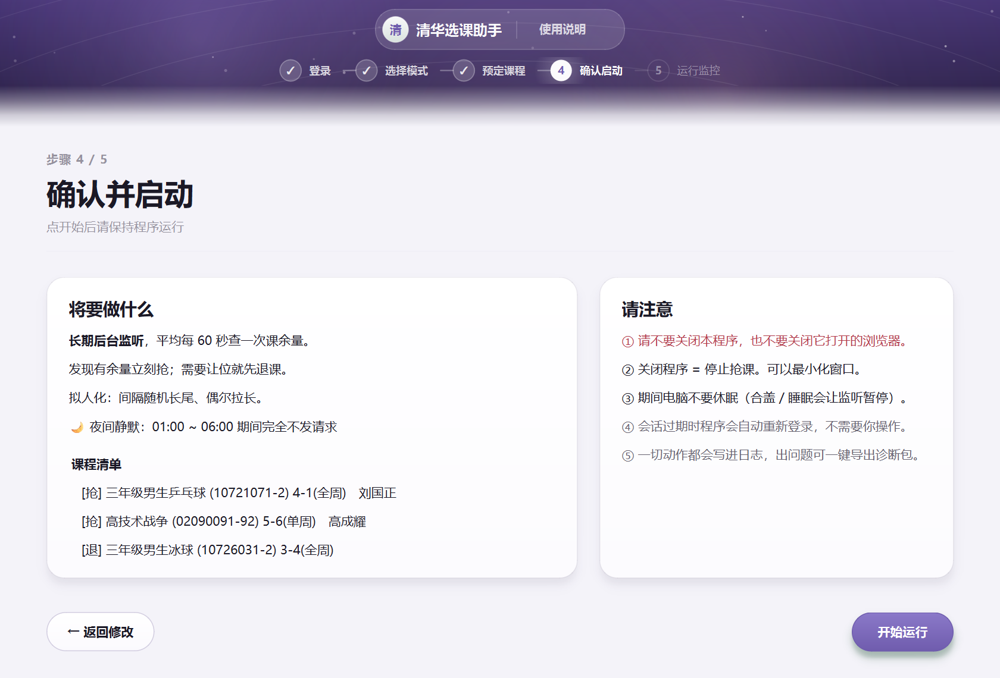
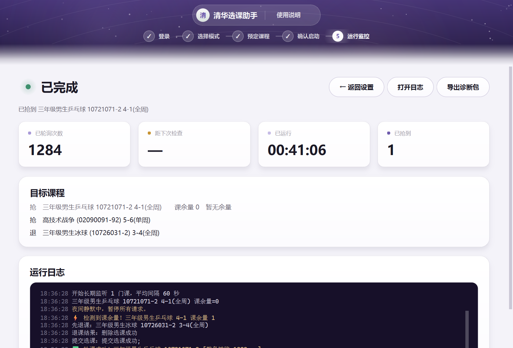

# 学校选课助手

自动盯课余量、按预定时间抢课。全程用**真实 Chromium 浏览器**操作 ——
登录、点页签、勾选课程、点提交都是真实的鼠标键盘事件，不发送脚本化的后台请求。

## 下载

到 [**Releases**](https://github.com/Tambacy/xk/releases) 页面下载：

| 文件 | 大小 | 说明 |
|---|---|---|
| `XkHelper-Setup-0.3.6.exe` | 334 MB | 安装包，推荐。自包含，装完即用 |
| `XkHelper-v0.3.6-source.zip` | 1476 KB | 源码，自行修改或构建用 |

安装包体积大是因为内置了一整个 Chromium（解压后约 426 MB）—— 程序需要真实浏览器
才能以真实事件操作页面，而不是发送脚本化的 HTTP 请求。



<details>
<summary>更多界面截图</summary>

**选择运行模式**



**预定课程** —— 左侧录入，右侧自动校验并显示卡片（已定位 / 需补充 / 时间冲突）



**确认启动**



**运行监控** —— 状态、统计、实时日志



</details>

---

## 功能范围

按设定的节奏反复检查目标课程是否有课余量，一旦发现就（必要时先退掉占位的课）
立即提交选课。程序不决定选什么课，也不提高中签率 —— 它解决的是
「别人退课的那一瞬间人不在电脑前」这个问题。

| 支持 | 不支持 |
|---|---|
| 按时间点自动开始选课 | 在报名 / 抽签阶段插队 |
| 长期监听课余量，发现即抢 | 绕过系统的任何限制 |
| 抢课前自动退掉冲突或让位的课 | 在程序未运行时继续监听 |
| 抢不到时自动把退掉的课选回来 | |
| 会话过期后自动重新登录 | |

---

## 三种运行模式

| 模式 | 适用场景 | 行为 |
|---|---|---|
| **一** | 选课尚未开始（已投志愿待抽签） | 按学校通知的时间提前盯「当前选课阶段」，一旦变为先到先得即自动选课 |
| **二** | 选课即将开始，且已有课需要让位 | 到点先退冲突课再抢；抢不到则自动还原退掉的课 |
| **三** | 选课进行中，等待他人退课 | 长期监听，可设平均间隔（最长 1 小时）；发现余量立即抢 |

请求节奏按模式区分：模式一 / 三为慢节奏（间隔随机长尾、偶发延长、夜间静默）；
模式二在等待期间慢节奏，提交瞬间全速。

---

## 从源码构建

```powershell
cd xk_app
powershell -ExecutionPolicy Bypass -File build.ps1
# 产物：installer\XkHelper-Setup-0.3.6.exe（约 330 MB，自包含）
```

依赖：Python 3.13、PySide6、playwright、PyInstaller、Inno Setup 6。

`build.ps1` 会依次生成图标、打包、并执行**打包后自检**；自检不通过则中止，不会产出
安装包。构建产物也可直接运行：`xk_app\dist\XkHelper\XkHelper.exe`。

---

## 首次登录

使用学校统一身份认证账号（即 info.tsinghua.edu.cn 使用的账号）。首次登录通常
会被要求二次验证（短信 / 企业微信），**全程只在程序主窗口内完成**：

1. 账号密码由程序填入并提交
2. 学校要求二次验证时，登录页出现提示区域，按三步操作：
   - **第 1 步** 选择验证码发送方式（手机短信 / 企业微信）
   - **第 2 步** 输入收到的 6 位验证码（3 分钟内有效，未收到可点「重新发送」）
   - **第 3 步** 学校询问「是否把本设备登记为信任设备」。选「是」则 180 天内
     本机再次登录无需验证码（会话过期后的自动重登也不会被拦）；选「否」则下次
     仍需验证码
3. 程序在后台页面完成提交，登录继续

图形验证码同样在此区域完成，验证码图片会直接显示在窗口内。

> 「信任此浏览器」（登录页勾选框）与上述第 3 步是两件事：前者是学校的统一登录
> 开关，用于免输账号密码；后者才免验证码。

若验证页面结构与程序预期不符而无法识别，程序会先询问是否打开浏览器窗口，
经确认后才打开。任何时候都可点「取消登录」放弃本次登录。

登录通常耗时 10~40 秒。

> 统一身份认证按设备记录信任状态。本机验证过一次之后不再要求，因此**不要**在
> 登录页点「连浏览器身份一起重置」—— 那会使本机被视为新设备，之后每次登录都会
> 要求二次验证。

---

## 项目结构

```
xk_app/
  app/
    browser.py          浏览器会话 + 教务系统页面操作
    courses.py          课程定位 + 周次感知的时间冲突检测
    humanize.py         请求节奏控制（间隔分布 / 鼠标轨迹 / 逐字输入）
    scheduler.py        三种运行模式的调度器
    secretstore.py      DPAPI 凭据加密 + 日志脱敏
    logging_setup.py    双通道轮转日志 + 诊断包导出
    stealth.py          无头模式下的浏览器特征处理
    runtime.py          打包后的路径处理
    config.py           配置持久化（原子写 + BOM 容错）
    gui/
      main_window.py    主窗口
      pages.py          登录 / 模式 / 课程 / 确认 / 监控 五个页面
      core.py           界面与浏览器之间的桥（工作线程）
      widgets.py        通用组件
      theme.py          配色与样式表
  _creds.py             开发期探针与测试的统一凭据入口（环境变量 → DPAPI → 旧明文）
  docs/使用说明.html     随安装包发布的使用说明
  docs/screenshots/     README 与说明文档引用的界面截图
  main.py               入口（含 --selftest 自检）
  xk.spec            PyInstaller 配置
  installer.iss         Inno Setup 配置
  build.ps1             一键构建
  test_*.py             测试
```

---

## 实现说明

### 为什么使用真实浏览器

裸 HTTP 请求会暴露 Python 库的 TLS 指纹、缺失的浏览器请求头，以及
`isTrusted=false` 的合成事件，这些都是明显的脚本特征。使用真实浏览器则不存在这些
问题。代价是安装包需要内置一整个 Chromium（约 330 MB）。

### 请求节奏

- 轮询间隔随机浮动并带长尾停顿，取值区间连续（用乘法而非加法构造长尾，
  避免直方图出现永远取不到的空档）
- 相邻两次间隔不重复；鼠标沿轨迹移动；输入逐字键入并偶发停顿
- 01:00~06:00 不发送任何请求
- 会话过期自动重新登录；抢课中途掉线时先重登再继续

### 隐私

- 账号密码经 Windows DPAPI 加密，绑定当前用户与当前电脑，**明文不落盘**
- 日志与诊断包中的密码、学号、Cookie 在写入前即替换为 `***`
- **安装包不含任何账号数据**；凭据存放在 `%LOCALAPPDATA%\XkHelper\`，不随分发
- 登录页的「清除本机已保存的账号密码」分两步询问：仅清除密码（浏览器信任状态
  保留），或连同浏览器身份一起重置（会触发二次验证，不可逆）
- 开发期探针与测试统一通过 `xk_app/_creds.py` 读取凭据，不各自读取明文

### 窗口行为

- **全程只有一个窗口**：验证码（短信 / 企业微信 / 图形）均在程序登录页内完成，
  程序在后台页面代为填交；图形验证码会截图显示在主窗口内
- **浏览器窗口可随时关闭**：程序检测到后会以同一浏览器配置目录在后台重开，
  登录状态与「信任此设备」状态均保留，不中断运行
- 「运行设置」中的「显示浏览器窗口」为偏好项，不勾选则浏览器始终在后台运行

---

## 测试

```powershell
cd xk_app
& $PY test_security_logging.py    # DPAPI 加解密、日志脱敏、诊断包（离线）
& $PY test_selection_guard.py     # 抢课决策校验：选错课拦截、回滚、取数策略（离线）
& $PY test_second_factor.py       # 二次验证三步识别，使用真实页面片段（离线）
& $PY test_scheduler.py           # 选课阶段判断、让位逻辑
& $PY test_gui_smoke.py           # 界面渲染回归
& $PY test_live_flow.py           # 真实环境全流程，只读 + 试运行，不改动选课结果
& $PY test_e2e.py                 # 端到端：登录 → 校验 → 监听 → 停止
```

前三项不需要联网、不需要账号。`test_live_flow.py` 会登录并读取真实数据，但只读、
不改动选课结果。后三项会连接真实教务系统。

凭据来源：探针与测试统一通过 `_creds.py`，按「环境变量 `XK_USER` / `XK_PASS`
→ Windows DPAPI 加密存储 → 旧明文文件」的顺序读取。

打包后自检（不需要图形界面、不需要登录）：

```powershell
.\dist\XkHelper\XkHelper.exe --selftest
```

---

## 已知实现约束

供后续维护参考，均为真实环境实测结果：

- 登录 token 在 HTML 中跨行，`name="token"` 与 `value` 之间存在换行，按单行正则
  匹配会全部失败
- 选课页面为 GBK 编码，中文参数需按 GBK 百分号编码
- 连续快速提交选课会触发系统防刷（提示「请输入正确的验证码」），间隔需 ≥2.5 秒
- 每学期只能选一门体育课，抢新课前必须先退掉旧课
- 「课表查询」页面显示为空，权威的已选课程列表在 `m=yxSearchTab`
- 各类课程页列数不同（必修 10 列 / 任选 11 列 / 体育 8 列），须按表头名映射列
- URL 筛选参数仅体育课有效；其他类别必须经由页面搜索，任选课不搜索则始终返回
  「没有记录」
- 会话过期返回 HTTP 200 加一个约 355 字节的小页面，不能靠状态码判断
- PyInstaller windowed 模式下 `sys.stdout` 为 `None`，会导致 Playwright 启动
  node 子进程时挂起
- GBK 控制台输出 emoji 会抛 `UnicodeEncodeError`，在 windowed 模式下表现为静默崩溃
- 系统 Edge 会触发二次认证，Playwright 自带的 Chromium 不会，因此安装包必须
  内置浏览器

---

## 免责

仅供本人选课使用。请遵守学校相关规定，合理设置监听间隔，不要给服务器造成压力。
